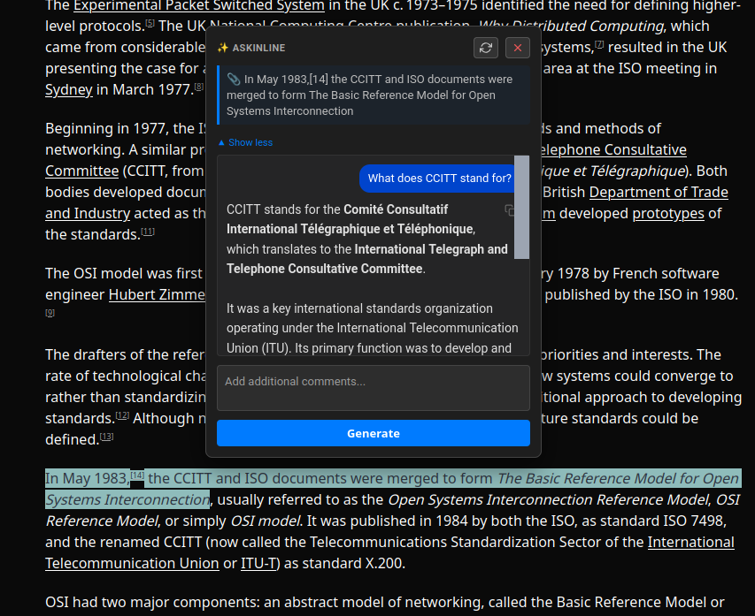

<div align="center">
  
  <h1>AskInline</h1>
  <p><strong>Ask your AI without leaving the page.</strong></p>
  <p>
    
    
    
    
  </p>
</div>

---

AskInline is a Firefox extension that integrates Google's Gemini AI directly into your browser context menu. Select text on any webpage and instantly query Gemini about it: definitions, translations, summaries, and more, without ever opening a new tab.

<div align="center">
  
</div>

## ✨ Why AskInline?

Switching tabs to ask an LLM a quick question is a friction point. **AskInline eliminates that friction** by bringing the model to the text. It's built with **Manifest V3** and **Vanilla JS**, keeping it extremely lightweight — no build steps, no heavy frameworks, just pure speed.

## 🚀 Features

| Feature | Description |
|---|---|
| **Contextual Analysis** | Right-click any selection to "AskInline" via the context menu |
| **Draggable UI** | Responses appear in a non-intrusive, movable & resizable modal |
| **Markdown Rendering** | Formatted responses with bold, code blocks, lists, and more |
| **Model Selection** | Switch between `Gemini 3 Flash`, `Pro`, or `Lite` on the fly, or any available model, really |
| **Streaming** | Responses stream in real-time, token by token |
| **Privacy First** | Your API key stays local in `browser.storage.sync` — never sent to third parties |

## 📦 Installation

1. Clone this repository:
   ```bash
   git clone https://github.com/liamtoaldo/AskInline.git
   ```
2. Open Firefox and navigate to `about:debugging`.
3. Click **"This Firefox"** → **"Load Temporary Add-on"**.
4. Select the `manifest.json` file from the cloned folder.

## ⚙️ Configuration

1. Get your API Key from [Google AI Studio](https://aistudio.google.com/).
2. Open the extension settings (via the standard browser options page).
3. Paste your key and select your preferred model.
4. Save — you're ready to go.

## 🛠 Tech Stack

- **Manifest V3** — Modern extension architecture
- **Vanilla JS** — Zero dependencies, zero build steps
- **Google Gemini API** — Streaming generative AI responses
- **marked.js** — Lightweight Markdown rendering
- **prism.js** — Syntax highlighting for code blocks

## 📄 License

This project is licensed under the [MIT License](LICENSE).
